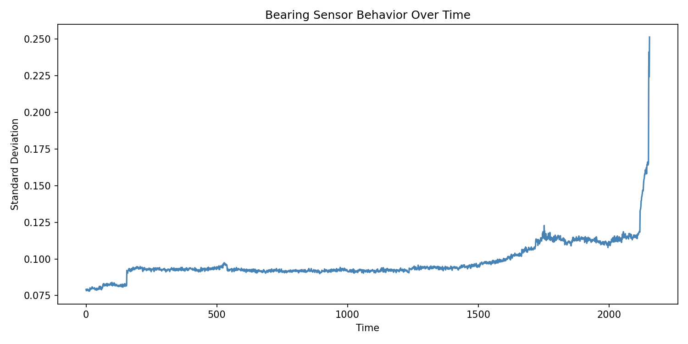
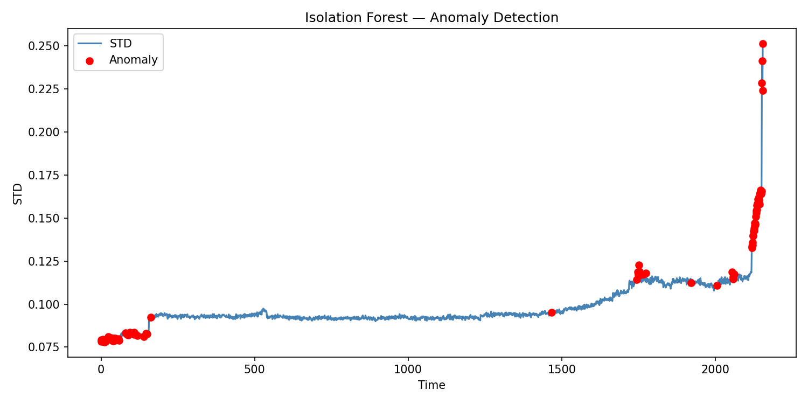
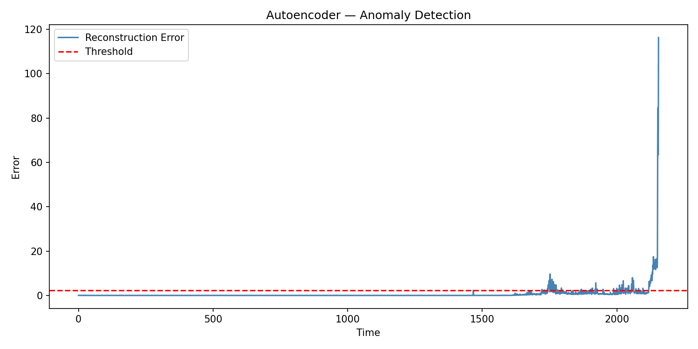

# Time Series Anomaly Detection for IoT Sensors
**[Live Demo](https://akilrahmantimeseriesanomalydetection.streamlit.app/)**

> Detecting bearing failure 2,000+ time steps before catastrophic breakdown using unsupervised ML on NASA industrial sensor data.

---

## The Problem

Industrial equipment fails without warning. Unplanned downtime costs manufacturers millions. This project builds an unsupervised anomaly detection system that identifies abnormal sensor behavior early — before failure occurs — using only normal operating data as reference.

**No labeled anomalies. No ground truth. Real-world conditions.**

---

## Results

| Metric | Value |
|---|---|
| Total sensor readings analyzed | 2,156 |
| Anomalies detected (Isolation Forest) | 108 |
| Anomalies detected (Autoencoder) | 108 |
| Cross-model agreement (both flagged) | 51 points |
| First anomaly detected at time step | ~180–230 |
| Final failure occurs at time step | ~2,156 |
| **Early warning lead time** | **2,000+ time steps** |

---

## Visualizations

### Bearing Sensor Degradation Over Time


### Isolation Forest — Anomaly Detection


### Autoencoder — Reconstruction Error


---

## Methodology

**Dataset:** NASA Bearing Dataset — real vibration sensor data from industrial bearings run to failure.

**Approach:**
1. Raw sensor files loaded and ordered chronologically
2. Statistical features extracted per time window (mean, std, RMS, max)
3. Features standardized for model compatibility
4. Two unsupervised models applied independently:
   - **Isolation Forest** — isolates rare patterns by random partitioning
   - **Autoencoder** — learns normal behavior, flags high reconstruction error as anomalies
5. Cross-model agreement used as confidence signal — 51 points flagged by both models

**Validation Strategy:**
Since no ground truth labels exist, validation was done through:
- Cross-model agreement rate between Isolation Forest and Autoencoder
- Alignment with known bearing degradation physics (vibration increases before failure)
- Visual confirmation that anomalies cluster near the failure zone

---

## Models

### Isolation Forest
Detects anomalies by isolating data points that are statistically rare. Sensor windows requiring fewer splits to isolate are classified as anomalies.

### Autoencoder (Deep Learning)
Trained only on normal behavior. At failure, reconstruction error spikes sharply — the model cannot reconstruct patterns it has never seen. Threshold set at 95th percentile of training reconstruction error.

---

## Key Finding

The system detected the first signs of bearing degradation at time step ~180–230. The bearing did not catastrophically fail until time step ~2,156.

**That is over 2,000 time steps of early warning** — enough lead time to schedule maintenance, prevent unplanned downtime, and avoid equipment damage.

---

## Business Impact

This approach enables **predictive maintenance** — replacing reactive ("fix after it breaks") and preventive ("fix on a schedule") maintenance with data-driven intervention at exactly the right time.

- Reduce unplanned downtime
- Extend equipment life
- Cut unnecessary maintenance costs

---

## How to Run

```bash
git clone https://github.com/Akilrahman/Time_Series_Anomaly_Detection
cd Time_Series_Anomaly_Detection
pip install -r requirements.txt
```

Download the NASA Bearing Dataset from [Kaggle](https://www.kaggle.com/datasets/vinayak123tyagi/bearing-dataset) and place it in: